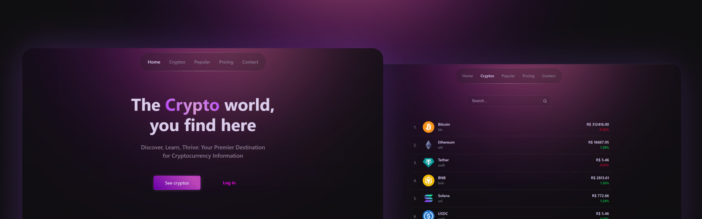

<h1 align="center">
    
</h1>

<h1 align="center">
  <a href="#"> Crypto Search </a>
</h1>

<p align="center">

  
  
  <a href="https://github.com/felipelourencosilva/crypto-search">
    
  </a>
    
  

  <a href="https://github.com/felipelourencosilva/">
    
  </a>
</p>

<h4 align="center"> 
	 Status: In Progress
</h4>

<p align="center">
 <a href="#about">About</a> •
 <a href="#features">Features</a> •
 <a href="#how-it-works">How it works</a> • 
 <a href="#tech-stack">Tech Stack</a> •  
 <a href="#author">Author</a> • 
 <a href="#license">License</a>
</p>

## About

📈 CryptoSearch is an application that allows you to search for various cryptocurrencies and access detailed information about them.  🚀

---

## Features

- [x] Explore new cryptos.
- [x] Search for specific ones.
- [x] Click on the one you want to see more information about.

---

## How it works

The project is a front-end application that allows you to view crypto information, search for a specific crypto, or explore the popular cryptos of the day.

This application uses <a href="https://www.coingecko.com/pt/api">CoinGecko's API</a> as a source of information.

### Pre-requisites

If the application is not fetching data correctly, you may need to create an API key. Follow these steps:

- Go to <a href="https://www.coingecko.com/pt/api">CoinGecko's API page</a> and create an account.
- Go to the <a href="https://www.coingecko.com/pt/developers/painel">Developers panel</a> and generate your API key.
- Create a .env file in the root directory of the project.
- Add the following line to the .env file: VITE_APP_API_KEY={your key here}
- Run the project.
- The API is free, but you have a limit of calls per minute. If the page is taking some time to load, your limit may be exceeded. Just wait a few more seconds and try again.


#### Running the web application

```bash

# Clone this repository
$ git clone git@github.com:felipelourencosilva/crypto-search.git

# Access the project folder in your terminal
$ cd crypto-search

# Install the dependencies
$ npm install

# Run the application in development mode
$ npm run dev

# The application will open on the port: 5173 - go to http://localhost:5173

```

---

## Tech Stack

The following tools were used in the construction of the project:

- **[React](https://react.dev/)**
- **[React Router Dom](https://github.com/ReactTraining/react-router/tree/master/packages/react-router-dom)**
- **[React Icons](https://react-icons.github.io/react-icons/)**
- **[Axios](https://github.com/axios/axios)**

#### [](#)**Utils**

- API: **[CoinGecko API](https://www.coingecko.com/pt/api)**
- Editor: **[Visual Studio Code](https://code.visualstudio.com/)**
- Icons: **[Feather Icons](https://feathericons.com/)**
- Fonts: **[Inter](https://fonts.google.com/specimen/Inter)**

---

## Author

<a href="https://www.linkedin.com/in/felipelourencos/">
 <p><b>Felipe Lourenço</b></p>
</a>

[](https://www.linkedin.com/in/felipelourencos/)

---

## License

This project is under the license [MIT](./LICENSE).

---
